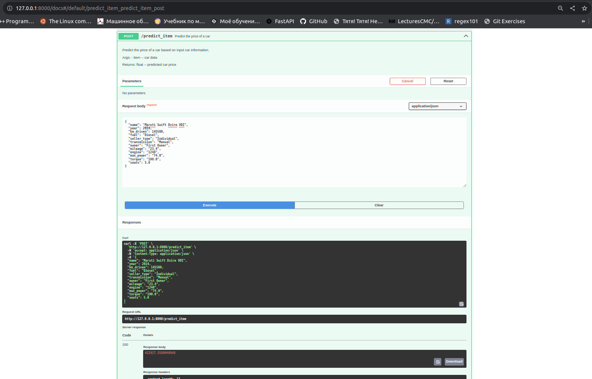
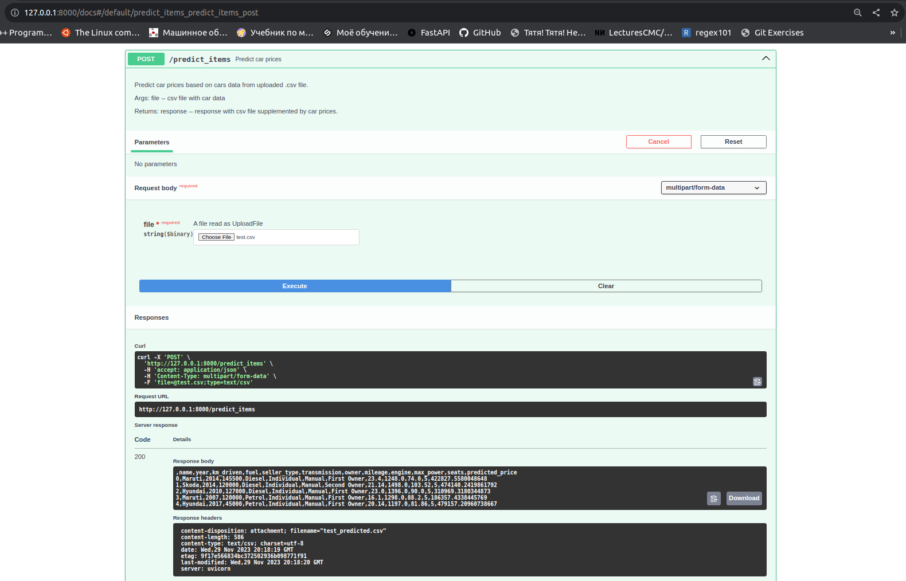

# А предскажи-ка мне цену на эту тачку
Сервис для прогнозирования цены на автомобиль, в зависимости от его технических характеристик и сопутствующей информации. Данный проект реализован в рамках домашнего задания по курсу Machine Learning магистратуры МОВС Факультета комьютерных наук ВШЭ.

Цель работы — реализовать веб-сервис для прогнозирования цены на автомобиль в зависимости от его характеристик. Для этого необходимо было провести разведочный анализ данных, выявить и визуализировать зависимости между характеристиками автомобиля и целевой переменной (цены), при необходимости сформировать и дополнить данные новыми признаками, или изменить имеющиеся, обучить линейную модель и обернуть ее в простейший веб сервис для удобства взаимодействия.

## Разведочный анализ данных

На этом этапе данные были изучены на наличие пропусков, дубликатов, были выявлены и визуализированы зависимости и корреляции между признаками и целевой переменной, оценены распределения некоторых признаков.

Пропуски были выявлены только в численных данных и были заполнены соответствующими медианами, дубликаты были удалены. Признаки 'mileage', 'engine', 'max_power' были очищены от информации об единицах измерения, а признак 'torque' разбит на два численных признака: 'torque' и 'max_torque_rpm'.

## Первые попытки обучения модели

Тут мы пытались в лоб обучить линейные модели с регуляризацией и без. Сначала только на численных данных, после нормализации, а затем с категориальными признаками, закодированными при помощи OneHotEncoder. Результат получился значительно лучше при добавлении категориальных признаков, но в обоих случаях неудовлетворительный. Качество модели было плохим, а веса очень большими из-за больших значений целевой переменной. Регуляризация после подбора параметров занулила некоторые веса, однако не повлияла существенным образом на качество модели.

## Feature-engineering

В этой части мною были предприняты всякого рода попытки дополнить/изменить данные с целью улучшить качество модели. Результат после каждой итерации проверялся как на тестовых данных, так и на кросс-валидации.

### Что получилось?

- Получилось слепить новые признаки из уже имеющихся: max_power / engine — мощность на единицу объема двигателя, year^2 — так как зависимость целевой переменной от признака year напоминает квадратичную, log(engine), log(km_driven) — чтобы приблизить несимметричное распределение этих величин к нормальному. Это дало довольно занчительный прирост качества модели.
- Получилось логарифмировать целевую перменную, сделав ее распределение более симметричным и убрав громоздкие значение цены на автомобиль. Пожалуй, именно это дало наиболее ощутимый прирост качества.
- Добавление категориального признака 'name' - марки автомобиля. Метрики также заметно подросли. Но распределение марок машин в данных очень неравномерное. В идеале хотелось бы иметь больше данных, чтобы оно было хотя бы издали равномерным.
- Использовал Ridge регрессию, в результате метрики не улучшились, но некоторые околонулевые веса занулились и это хорошо. В целом, я пока затрудняюсь твердо и четко ответить на вопрос "зачем?", решил использовать L2 регуляризацию, так как "почувствовал", что так надо (чтобы занулить очень малые веса и избавиться от переобучения (хотя его тут вроде бы и не было вовсе)).

### Что не получилось?

- Обработать пропуски в данных. Добавление столбцов-индикаторов дало несущественный прирост.
- Добавить полиномиальные признаки. Хоть с ними в некоторых итерациях получался довольно заметный прирост качества, однако по итогу без них модель показывает практически идентичный результат. А еще в ряде случаев с полиномиальными признаками на кросс-валидации творился сущий кошмар (большие по модулю отрицательные метрики) и они приводили к переобучению.
- Использовать полученные в EDA признаки 'torque' и 'max_torque_rpm'. Оказалось, что без них тоже самое либо сильно лучше. Порой тоже приводили к переобучению.
- Обработать выбросы. Честно говоря, не придумал ничего умнее, кроме как удалить часть данных со статистическими выбросами, но по итогу ни к чему хорошему это не привело, решил оставить как есть.

### Бизнес метрика

Получилась плохой :(. Доля предсказанных цен, отличающаяся от реальных менее, чем на 10% составила всего 0.373. Я хотел бы попробовать как-то использовать эту метрику в качестве функции ошибки при обучении, но не уверен, что это правильно, и не уверен, что так можно. В любом случае, не хватило на это времени.

### FastAPI сервис

Был сделан, протестирован, работает. Но из-за нехватки времени и опыта кое-что в нем мне не нравится и хотелось бы в будущем его доработать. Ниже скриншоты в доказательство работоспособности. Чтобы запустить, надо написать ```uvicorn app:app --reload``` (мне так больше нравится, чем из кода). В репозитории лежат файлы *test.csv* и *predicted.csv*, это тестовые данные на вход сервиса и результат, соответственно, можно поиграться. Данные модели с весами, энкодерами и скейлерами лежат в *model_data.pickle*, оттуда же и подтягиваются в сервис.





## TODO

- Улучшить заданную бизнес-метрику любой ценой. Возможно, стоит использовать ее в качестве функции ошибки при обучении модели.
- Попробовать таки еще поработать с пропусками (маркировать пробовал)
- Попробовать таки еще поработать с выбросами (удалять пробовал)
- Разбить веб-сервис на логичные модули (мл/сам сервис)
- Реализовать валидацию .csv файла на вход
- Реализовать автоматичекое скачивание .csv как при GET запросе (хочу чтоб в папки "Загрузки прям качался")
- Сделать мир лучше
